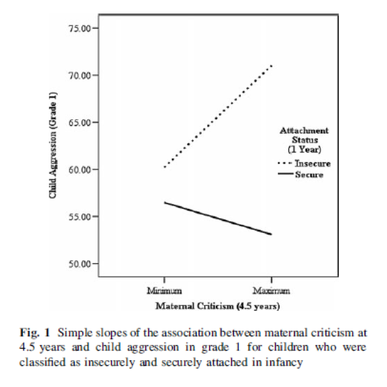
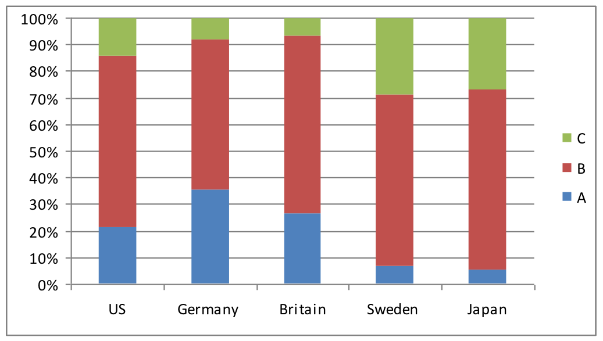

# 改变儿童教养方式与儿童临床心理学的研究（上）：Attachment（依恋理论）
A strong disposition to seek proximity to and contact with a specific attachment figure and to do so in certain situations, notably when frightened, tired or ill.
在焦虑、惊吓、和虚弱的时候对一个人的强烈需求。在这个人身边可以感受到安全感

## 哈洛的恒河猴实验
### 实验简介
+ 对象：刚出生不久就被分离的小恒河猴
+ 重要工具 —— 两个假妈：一个用铁丝网制作（放置了奶瓶，可以喂食），一个用棉布制作

+ [视频](https://www.youtube.com/watch?v=OrNBEhzjg8I)：
  - 16s：第一个实验：让出生不久的小猴在这两个代替妈妈中做出选择
  - 2:50s：第二个实验：让小猴受到惊吓，看它们会向哪个妈妈寻求庇护
  - 4:00s：第三个实验：陌生情境下，有不同妈妈在场是否会影响小猴子探索环境的行为（视频只显示了部分）

**Harlow 的实验说明，单纯的喂食并不能让孩子产生对母亲的依赖，而身体接触对于建立健康的母婴连接十分重要。**

## Bowlby 的依恋理论
### Bowlby 背后的男人和他的鸭子

+ Konrad Lorenz 研究动物行为学，发现了禽类的印刻（imprinting）行为:
刚从蛋里爬出来的小鸭子会把它们看到的第一个会动（并且鸭叫）的东西当作妈。Lorenz 本人还被一群鹅当作了妈妈👇

Q：动物的这种行为是否有进化学上的意义？

### Bowlby 的暗中观察

+ 深受动物行为学研究的启发，通过他对婴儿的观察，提出（广义上）人类和禽兽十分相似~~并无区别~~。新生儿虽然做不到一出生就围着母亲爬，但是已经可以展现出对于母亲的特别偏好

+ 解释了母亲亲近婴儿并且保护婴儿的倾向是一种**本能**。为什么是本能？
  - 在其他物种中也存在
  - 这种行为基本没有个人差异，而且可预测
  - 保证个体和物种存活
  - 不通过学习也会产生

**Bowlby 拓展了前面提到的 Harlow 的研究结论，发现孩子与母亲的情感连接与身体接触并无直接联系**

## Mary Ainsworth 的依恋理论
**细化依恋理论，提出不同的依恋类型**

### 方法：[陌生情境](https://www.youtube.com/watch?v=PnFKaaOSPmk) (1:50s)
+ 实验对象：1岁左右的宝宝

+ **Strange Situation Procedure (Simplified) **

1. Experimenter introduces Parent and Baby to playroom and leaves
2. Parent sits while Baby plays. (**parent as secure base**)
4. Parent leaves (**separation anxiety**)
5. Parent returns, greets Baby, offers comfort to Baby if necessary, and tries to interest Baby in toys. Stranger leaves (**reunion behavior**)

### 依恋类型：
+ **安全依恋型**
  - 妈妈是「安全基地」，有妈妈在就敢探索新环境
  - 与妈妈分离时非常焦虑，而且停止了探索的行为
  - 妈妈回来时，想和妈妈接触和互动

+ **不安全依恋型：回避型**
  - 妈妈不在的时候基本不哭
  - 与妈妈重聚时，并不想主动靠近妈妈，有躲闪的行为，甚至是直接无视妈妈

+ **不安全依恋型：焦虑-矛盾型**
  - 还未与妈妈分离时就已经表现出焦虑
  - 与妈妈分离时过分焦虑
  - 与妈妈重聚时表现矛盾，一边想接近妈妈，但是又拒绝和妈妈互动

+ **不安全依恋型：「无法捉摸」型**
  - 与妈妈重聚时举止怪异，例如有重复行为（比如摇晃身体）
  - 与妈妈重聚时表现矛盾，接近妈妈但是又会害怕得躲开妈妈

### 其他关于依恋类型的讨论
+ 与教养方式**有关**？—— **有关系但是比较弱**
  - 安全依恋型与「高敏感性」的教养方式有关系（能够正确感知和回应孩子的需求，有效降低孩子的焦虑）
  - 与回避型「对应」的教养方式：提供过多刺激，并且倾向于拒绝孩子的需求
  - 与焦虑-矛盾型「对应」的教养方式：行为模式不稳定（时而照顾孩子，时而忽略孩子），有时会错过孩子发出的信号
  - 「无法捉摸」的孩子则被认为与儿童虐待有关

+ 会跟随一生？—— 年龄越大，儿时的依恋模式越不明显（环境的作用）

### 文化差异？

A --> 回避型
B --> 安全型
C --> 焦虑型
